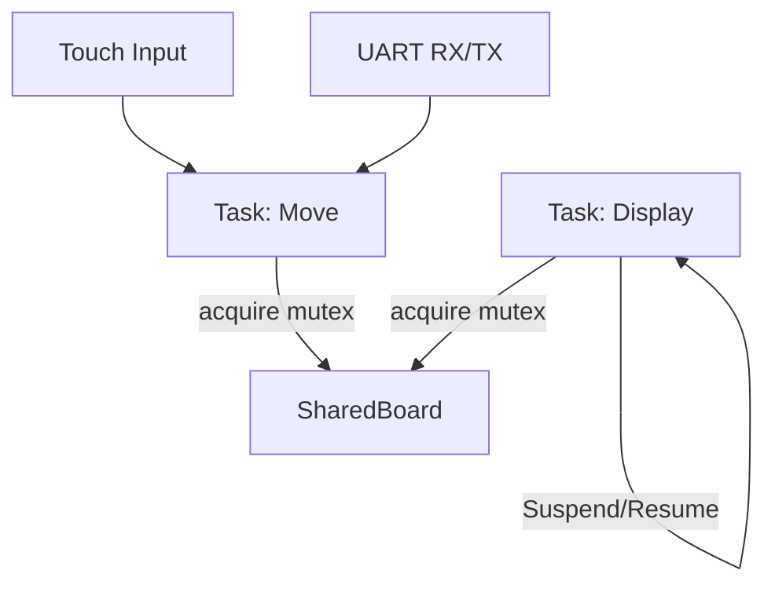
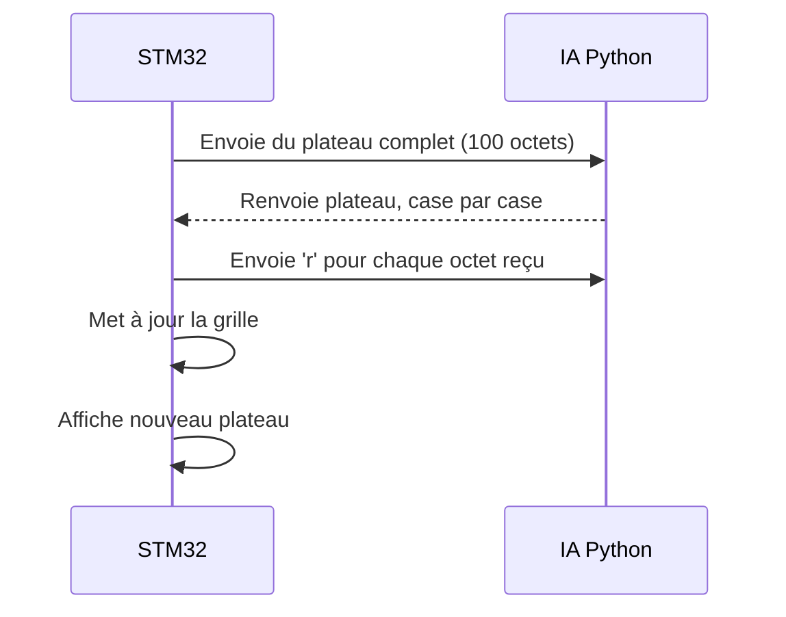

# Jeu de dames embarqué – STM32

Ce projet implémente un jeu de dames sur carte STM32 avec FreeRTOS, utilisant un écran tactile pour l’interface utilisateur et une communication UART pour le mode contre ordinateur. L’architecture repose sur deux tâches principales : une tâche d’affichage (`function_display_task`) et une tâche de gestion des mouvements et des interactions (`function_move`). La tâche d’affichage est responsable du dessin du menu, du plateau de jeu, des pions et des messages associés (tour du joueur, victoire, erreur de réception). Elle est suspendue lorsqu’elle n’a pas besoin de s’exécuter et relancée uniquement lorsque le plateau doit être mis à jour. La tâche de mouvement est la plus complexe : elle gère d’abord les entrées tactiles (menu ou plateau), les déplacements de pions, les règles de capture, de promotion et de victoire, ainsi que le mode CPU si activé.

Dans ce mode, au lieu de jouer directement, la tâche envoie tout le plateau via UART au PC, attend en retour un nouveau plateau reçu case par case, accuse réception de chaque octet avec un caractère `'r'`, et met à jour la grille une fois tous les octets reçus. Cette procédure est protégée par un mutex (`myMutex01`) pour éviter des conflits d'accès avec la tâche d’affichage.

En parallèle, plusieurs fonctions internes gèrent la logique du jeu : `is_valid_move` et `is_capture_move` pour vérifier la validité des mouvements normaux ou avec prise, `is_valid_move_king` et `is_capture_move_king` pour les dames, `has_additional_capture` pour vérifier les enchaînements de captures, `try_promote` pour transformer un pion en dame, et `check_victory` pour détecter la fin du jeu. Le plateau est représenté par une matrice 10x10, initialisée selon les règles classiques. Lorsqu’un pion atteint la dernière ligne, il est promu en dame.

En mode contre ordinateur, deux scripts Python distincts sont utilisés. Le fichier `train_dame_2.py` contient l’implémentation complète de l’apprentissage par renforcement d’un agent jouant aux dames. Deux agents (un par joueur) s’affrontent en alternance sur des centaines de parties simulées. Chaque agent utilise un réseau de neurones profond (`DamesNet`) pour évaluer les coups possibles à partir d’un encodage du plateau. Lorsqu’un agent est actif, il explore l’espace des coups légaux, apprend à maximiser sa récompense en capturant des pions ou en gagnant la partie, et ajuste ses poids via la méthode DQN (Deep Q-Learning). L’autre agent reste figé, ce qui permet à chaque joueur de progresser à tour de rôle. Les paramètres du réseau sont sauvegardés périodiquement sous forme de fichiers `.pt`.
Le script `UART.py`, quant à lui, utilise l’un des modèles entraînés pour affronter un joueur réel via une communication UART avec une carte STM32. Celle-ci envoie le plateau de jeu actuel, case par case, au PC hôte. Le script Python reconstruit ce plateau, le transmet au réseau de neurones pour choisir le meilleur coup, applique ce coup sur le plateau, puis renvoie le nouveau plateau modifié à la carte STM32, avec un accusé de réception attendu après chaque case. Ce découplage permet de garder la logique de jeu sur le microcontrôleur simple et stable, tandis que l’IA peut évoluer indépendamment grâce à l'entraînement sur PC.

L'ensemble du projet combine ainsi une interface utilisateur embarquée fluide, une logique de jeu robuste, et une extension possible vers l’intelligence artificielle par une communication série standard.

---

## Diagramme 1 – Tâches FreeRTOS et synchronisation

---

## Diagramme 2 – Mode IA via UART

---

## Fichiers Python liés

- `442_IA.py` : reçoit le plateau depuis la STM32, utilise un modèle appris, et renvoie un plateau mis à jour.
- `training_dame.py` : script d’apprentissage par renforcement d’un réseau de neurones pour apprendre à jouer.

Ces fichiers permettent de déporter toute l’intelligence du jeu vers le PC, rendant la carte STM32 responsable uniquement de l’interface et de l’exécution des ordres.
